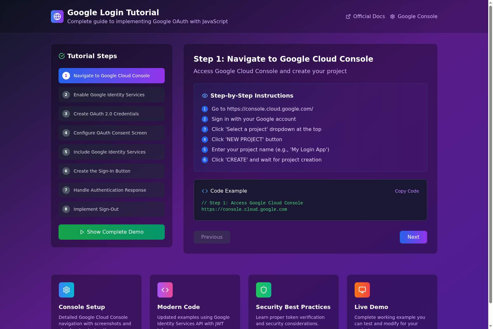

# 🔐 Google Login Tutorial



## 🌐 Live Demo
**🚀 [View Live Application](https://google-login-edu.vercel.app/)**

A comprehensive, interactive tutorial for implementing Google OAuth authentication with JavaScript. This educational project provides step-by-step guidance, working code examples, and a complete implementation you can test and modify for your own projects.

## ✨ Features

### 📚 **Interactive Tutorial Steps**
- 🎯 **8 Complete Steps** - From Google Cloud Console setup to full implementation
- 📋 **Step-by-Step Instructions** - Clear, numbered guidance for each phase
- 🔄 **Navigation Controls** - Easy movement between tutorial sections
- 📱 **Responsive Design** - Works perfectly on desktop and mobile devices

### 💻 **Working Code Examples**
- ✅ **Functional Copy Buttons** - One-click code copying to clipboard with visual feedback
- 🔧 **Modern Implementation** - Uses latest Google Identity Services API
- 🛡️ **Security Best Practices** - JWT token handling and verification examples
- 📝 **Complete HTML Demo** - Full working example with 300+ lines of code

### 🎨 **Beautiful UI/UX**
- 🌈 **Modern Gradient Design** - Purple-to-blue gradient with dark theme
- 🎭 **Interactive Elements** - Hover effects and smooth transitions
- 📊 **Progress Tracking** - Visual indication of current tutorial step
- 🎪 **Animated Feedback** - Success/error states for user actions

### 🔒 **Google OAuth Integration**
- 🏗️ **Google Cloud Console Setup** - Complete project configuration guide
- 🔑 **OAuth 2.0 Credentials** - Client ID and secret management
- 👤 **Identity Services** - Modern Google Sign-In implementation
- 🚪 **Sign-In/Sign-Out** - Complete authentication flow

## 🛠️ Technology Stack

- ⚛️ **React 18** - Modern React with hooks and functional components
- 📘 **TypeScript** - Type-safe development with full IntelliSense
- ⚡ **Vite** - Lightning-fast build tool and development server
- 🎨 **Tailwind CSS** - Utility-first CSS framework for styling
- 🧩 **Radix UI** - Accessible, unstyled UI components
- 🎯 **Lucide React** - Beautiful, customizable icons
- 🔐 **Google Identity Services** - Official Google authentication API

## 🚀 Quick Start

### Prerequisites
- 📦 Node.js 16+ installed
- 🔑 Google Cloud Console account
- 💻 Modern web browser

### Installation

1. **Clone the repository**
   ```bash
   git clone https://github.com/raimonvibe/google-login-edu.git
   cd google-login-edu
   ```

2. **Install dependencies**
   ```bash
   npm install
   ```

3. **Start development server**
   ```bash
   npm run dev
   ```

4. **Open in browser**
   ```
   http://localhost:5173
   ```

### 🏗️ Build for Production

```bash
# Build the project
npm run build

# Preview production build
npm run preview

# Run linting
npm run lint
```

## 📖 Tutorial Content

### 🎯 **Step 1: Google Cloud Console**
- 🌐 Navigate to Google Cloud Console
- 📁 Create new project
- ⚙️ Configure project settings

### 🔧 **Step 2: Enable Services**
- 🔌 Enable Google Identity Services
- 📋 Configure API permissions
- ✅ Verify service activation

### 🔑 **Step 3: OAuth Credentials**
- 🆔 Create OAuth 2.0 Client ID
- 🌍 Configure authorized domains
- 📝 Set redirect URIs

### 🛡️ **Step 4: Consent Screen**
- 📄 Configure OAuth consent screen
- 👥 Set user permissions
- 🔒 Privacy policy and terms

### 📚 **Step 5: Include Libraries**
- 📦 Add Google Identity Services script
- 🔗 Configure client initialization
- ⚙️ Set authentication parameters

### 🎨 **Step 6: Sign-In Button**
- 🖱️ Create interactive sign-in button
- 🎭 Style and customize appearance
- 📱 Responsive design implementation

### 🔄 **Step 7: Handle Response**
- 📨 Process authentication response
- 🔍 Decode JWT tokens
- 👤 Extract user information

### 🚪 **Step 8: Sign-Out**
- 🔓 Implement sign-out functionality
- 🧹 Clear user session
- 🔄 Reset application state

## 🎨 Design Features

### 🌈 **Visual Design**
- **Color Scheme**: Purple-to-blue gradient background
- **Typography**: Clean, readable fonts with proper hierarchy
- **Layout**: Responsive grid with sidebar navigation
- **Icons**: Lucide React icons throughout the interface

### 🎭 **Interactive Elements**
- **Copy Buttons**: ✅ Instant clipboard copying with "✓ Copied!" feedback
- **Navigation**: Smooth transitions between tutorial steps
- **Hover Effects**: Subtle animations on interactive elements
- **Loading States**: Visual feedback for user actions

### 📱 **Responsive Design**
- **Mobile-First**: Optimized for mobile devices
- **Tablet Support**: Perfect layout on tablet screens
- **Desktop Enhanced**: Full-featured desktop experience
- **Cross-Browser**: Compatible with all modern browsers

## 🔧 Development

### 📁 **Project Structure**
```
google-login-edu/
├── 📄 README.md
├── 📦 package.json
├── ⚙️ vite.config.ts
├── 📘 tsconfig.json
├── 🎨 tailwind.config.js
├── 📂 src/
│   ├── 📄 App.tsx          # Main application component
│   ├── 📄 main.tsx         # Application entry point
│   ├── 🎨 index.css        # Global styles
│   └── 📂 components/      # Reusable UI components
└── 📂 public/              # Static assets
```

### 🛠️ **Available Scripts**

- `npm run dev` - 🚀 Start development server
- `npm run build` - 🏗️ Build for production
- `npm run preview` - 👀 Preview production build
- `npm run lint` - 🔍 Run ESLint checks

### 🔧 **Configuration**

The project uses modern tooling with sensible defaults:

- **Vite**: Fast build tool with HMR (Hot Module Replacement)
- **TypeScript**: Strict type checking enabled
- **ESLint**: Code quality and consistency rules
- **Tailwind CSS**: Utility-first styling approach

## 🤝 Contributing

Contributions are welcome! Please feel free to submit a Pull Request.

### 📋 **Development Guidelines**
1. 🔀 Fork the repository
2. 🌿 Create a feature branch
3. 💻 Make your changes
4. ✅ Test thoroughly
5. 📝 Update documentation
6. 🔄 Submit a pull request

## 📄 License

This project is open source and available under the [MIT License](LICENSE).

## 👨‍💻 Author

**Raimon Baudoin**
- 🌐 Website: [raimonvibe.com](https://raimonvibe.com)
- 📧 Email: info@raimonvibe.com
- 💼 GitHub: [@raimonvibe](https://github.com/raimonvibe)

## 🙏 Acknowledgments

- 🔐 Google Identity Services team for excellent documentation
- ⚛️ React team for the amazing framework
- ⚡ Vite team for the lightning-fast build tool
- 🎨 Tailwind CSS team for the utility-first approach

---

**🚀 Ready to implement Google OAuth in your project? [Start the tutorial now!](https://google-login-edu.vercel.app/)**
